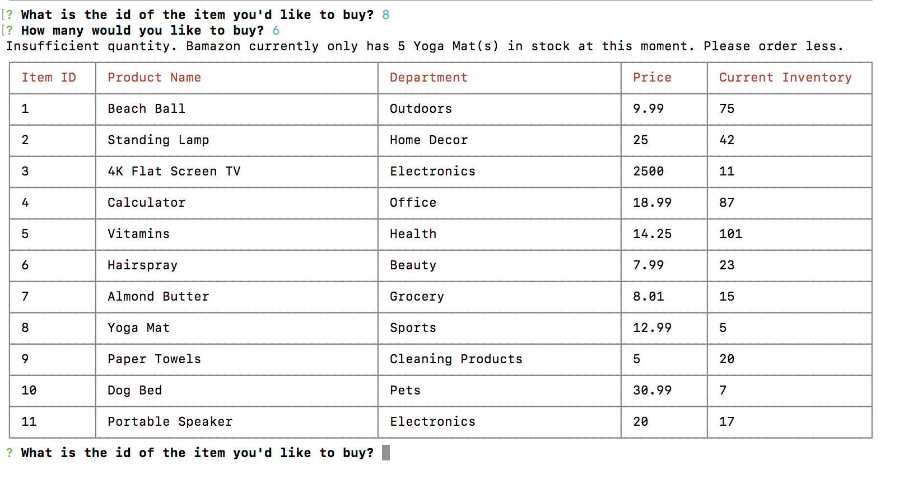

# Bamazon

## Overview

Bamazon is an interactive shopping node app that uses MySQL and Node.JS. I also used the CLI-Table 2 NPM to display the table in an easy to read fashion for the customer. 

In this application, customers will view an up-to-date Bamazon inventory table and will then be allowed to choose items to purchase.

## MySQL Database Setup

In order to run this application, you will need to install the MySQL database to your machine. If you don't have MYSQL installed, visit the [MySQL installation page](https://dev.mysql.com/doc/refman/5.6/en/installing.html) to install the version you need for your operating system. Once you have MySQL installed, you will be able to create the Bamazon database and the products table with the SQL code found in [schema.sql](schema.sql). Run this code inside your Sequel Pro (Mac) or MySQL Workbench (PCs) to populate the database. 

## NPM Installation Steps

1. First install the MYSQL, Inquirer, and CLI-Table1 NPMs.
2. Git clone this repository onto your computer: https://github.com/jnnfrsofia/bamazon.git
3. Run 'node bamazonCust.js' in the CLI.

Now you are ready to shop!

### Shopping Guide

Once you've entered, 'node bamazonCust.js' in the CLI, the inventory table will display and you will be prompted for an item id.

After you've entered the item id, you will be asked how many of this item you would like to purchase.

If there is enough of this item in stock, you will be given your total amount due, and the inventory table with updated stock quantities will be displayed. The prompt will start again.

If you enter a quantity of an item higher than Bamazon has in stock, the app will alert you of the insufficient quantity, and the app will restart.

